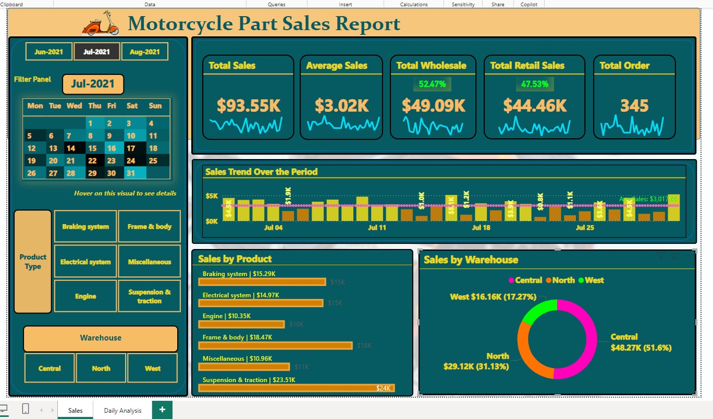
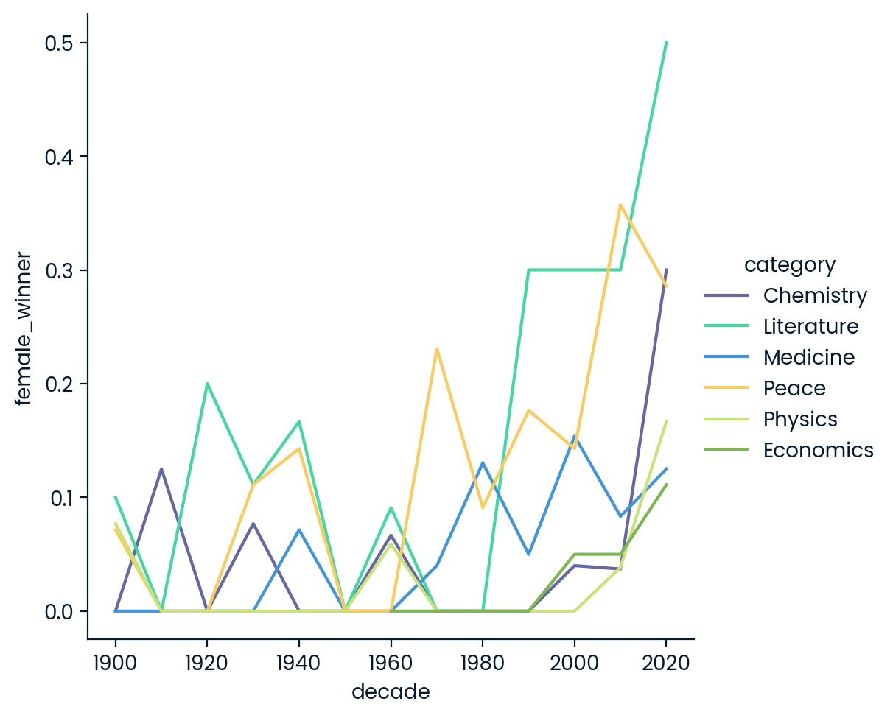

# Data Analyst

---

## Technical Skills:
---

| Programming & Data Analysis           | Data Visualization                    | Data Processing & ETL                    | Statistics & Advanced Analytics            | Database Management                    |
|---------------------------------------|---------------------------------------|-------------------------------------------|--------------------------------------------|---------------------------------------|
| - **Python**                          | - **Power BI**                        | - **Data Wrangling**                      | - **Hypothesis Testing**                   | - **SQL Optimization**                |
|    *Pandas*                            |    *Tableau*                          |   - **ETL**: *Python, SQL*                | - **A/B Testing**                         | - **Database Design**                 |
|    *NumPy*                             |    *Matplotlib*                       |                                           | - **Time Series Analysis**                | - **SQLite**                          |
|    *SciPy*                             |    *Seaborn*                         |                                           | - **NLP**: *Basic text analysis*          |                                       |
| - **SQL**                             | - **Excel**                          |                                           |                                            |                                       |

---

## Education:

B.S., Bussiness Administration | WSEI University
B.S., Human Resource Management | Zenith University

---
## IT certification:

[Certificates](https://www.linkedin.com/in/adewole-oyediran-6204a2263/details/certifications/)

---
## Social Network:

[Linkedin](https://linkedin.com/in/adewole-oyediran-6204a2263)

---
## Work Experience:
**Education Abroad Consultant @ Day-friends Zimbabwe Ltd (_Apr 2021 - Present)**
- Successfully guided over 90% of students in selecting suitable universities and programs, resulting in an 85% acceptance rate at top-tier institutions based on their academic background, interests, and career goals.
- Assisted 100+ students with the entire application process, leading to a 75% increase in successful university admissions by ensuring accurate completion of application forms, compelling personal statements, and effective interview preparation.
- Helped 70+ students identify and apply for scholarships, leading to 60% of them securing financial aid or scholarships, reducing their educational costs by an average of 30%.
- Offered comprehensive pre-departure advice to 120+ students, resulting in a 90% increase in student satisfaction and smoother transitions, including travel arrangements, accommodation, and cultural adaptation.

**Administrative Assistant @ Arestone Tyres Zimbabwe Ltd (_July 2020 - Feb 2021_)**
- Efficiently coordinated and maintained executive calendars, scheduling meetings and appointments to optimize workflow and reduce scheduling conflicts by 30%.
- Managed all incoming and outgoing communications, including emails, calls, and correspondence, ensuring timely and accurate information dissemination across departments.
- Prepared and proofread reports, presentations, and documents with a 99% accuracy rate, supporting executive decision-making and client communications.
- Accurately entered and maintained data in company databases, reducing errors by 20% and improving data retrieval speed by 15%.

**Field Researcher @ Practical Sampling International (_November 2015 - August 2019_)**
- Conducted on-site surveys and interviews across multiple locations, gathering critical consumer insights on products such as Coca-Cola, Star Radler, and Lux Soap, contributing to data accuracy and reliability.
- Executed field research initiatives by visiting various communities, collecting data on consumer preferences and behaviors to inform product development and marketing strategies.
- Successfully administered surveys and questionnaires to diverse demographic groups, achieving a 95% response rate and ensuring data integrity for market analysis.
- Collaborated with cross-functional teams to refine research methodologies and ensure consistency in data collection across different locations, enhancing the overall research quality.

---

## PROJECTS:
---

## Project 1

- ### Motorcycle Part Sales Analysis (June - August 2021)

This project involved analyzing motorcycle part sales data over a three-month period using SQL and PowerBI. The focus was on understanding total sales, orders, and quantities sold, alongside trends and performance comparisons. By cleaning and transforming the data, I uncovered key insights into sales by product category, store location, and client type.

 

 
I developed Key Performance Indicators (KPIs), analyzed daily and weekly sales trends, and performed dimensional analysis to provide a comprehensive view of business performance. The results informed actionable strategies for optimizing sales and improving overall business outcomes.

- [**SQL Query Documentation:** Motorcycle Part Sales Analysis](https://github.com/Bensha93/portfolio/blob/main/SQL%20Query%20Documentation_%20Motorcycle%20_Part%20Sales%20Analysis.pdf)

- [**PowerBI:** Motorcyle Part Sales Analysis](https://github.com/Bensha93/portfolio/blob/main/Motorcycle_Part_Sales_PowerBI.pbix)

---

  

## Project 2
- ### Nobel Prize Data Analysis (1901-2023)

In this project, I explore a Nobel Prize dataset (1901-2023) using Python, uncovering trends and answering key questions about the history of Nobel laureates. Through data analysis, I examined patterns related to gender, birth countries, and the prevalence of US-born winners. Additionally, I explored female representation across decades and categories, identified the first female laureate, and investigated individuals or organizations that have won multiple Nobel Prizes.

Python libraries like Pandas, Matplotlib, and Seaborn were used to clean, analyze, and visualize the data, delivering clear insights into over a century of Nobel Prize history.

- [**Python Query**: Nobel Prize Data Analysis (1901-2023)](https://colab.research.google.com/drive/1ozfvYIuKwlSgOk17p67s0dVEzfj8N2XZ?usp=sharing)

---

## Project 3
- ### Hypothesis Testing on Goal Scoring in Men’s vs. Women’s Soccer

This project analyzed whether women’s FIFA World Cup matches see more goals scored on average than men’s. Using historical match data since 2002, I conducted a statistical hypothesis test at a 10% significance level to compare scoring patterns. The analysis provided a data-driven insight for sports journalism, revealing scoring trends across men’s and women’s World Cup games.

**Tools Used: Python**

- **Pandas** for data cleaning and manipulation of match records.

- **NumPy** for efficient numerical operations.

- **SciPy** for conducting the hypothesis test.

- **Matplotlib/Seaborn** for visualizing goal-scoring trends.

These tools enabled thorough data analysis, statistical validation, and clear visualizations to support findings on goal-scoring dynamics in international soccer.

- [**Python Query**: Hypothesis Testing on Goal Scoring in Men’s vs. Women’s Soccer](https://colab.research.google.com/drive/18rZZ1Gc0bDx60Cs0WgiEfbEDW8PPB8qp?usp=sharing)

---
